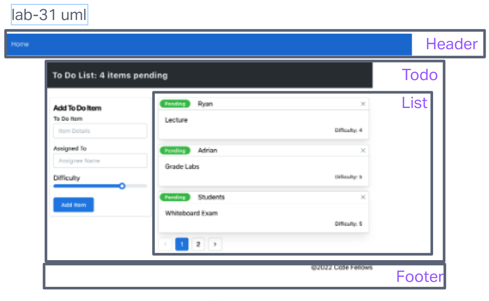

# LAB - Class 31

## Author: Kao Saelor

## Project: Context API

### Problem Domain  

In Phase 1, we’re going to perform some refactoring of a Todo application built by another team. This application mixes application state and user settings at the top level and passes things around. It was a good proof of concept, but we need to make this production ready.

- Create a Detailed UML.
- Properly modularize the application into separate components, note the proposed file structure below.
- Implement the Context API to make some basic application settings available to components.
  - Show three items by default.
  - Hide completed items by default.
  - Add the sort word ‘difficulty’ by default.

- Style the application using the Mantine Component API{target:_blank}

### Links and Resources

- [GitHub Actions ci/cd](https://github.com/CodingKao/todo-app/tree/context-settings)
- [front-end application]()

### Collaborators

### Setup

#### `.env` requirements (where applicable)

for now I have none and do not require one

#### How to initialize/run your application (where applicable)

- e.g. `npm start`

#### How to use your library (where applicable)
npm install @mantine/core @mantine/hooks @emotion/react

#### Features / Routes

- Feature One: Details of feature
- GET : `/hello` - specific route to hit

#### Tests

- npm test

#### UML

Used UML from in class demo from Ryan Gallaway.

# LAB - Class 32

## Project: Context API - Behaviors

### Problem Domain  

In Phase 2, we’re going to extend the functionality of our application by allowing the user to make some decisions on how they would like the application to function. Specifically, we’ll let them make changes to 2 settings.

- Implement the Context API to make some basic application settings available to components.
  - How many To Do Items to show at once.
  - Whether or not to show completed items.
  - Hint: if reusing the custom useForm() hook, event validation may be necessary if using any Mantine component other than <TextInput />.

- Provide the users with a form where they can change the values for those settings.
  - This should be given in the form of a new component, perhaps linked to from the main navigation.
  - Hint: Use Browser Router to create the page/route/component for this.
  - Once settings are updated, render the updated settings to the right of the “form”. Consider using <Grid />, <Card />, and <When /> components.

- Save the users choices in Local Storage.
- Retrieve their preferences from Local Storage and apply them to the application on startup.

### Links and Resources

- [GitHub Actions ci/cd]() 
- [front-end application]()

### Collaborators

### Setup

#### `.env` requirements (where applicable)

for now I have none and do not require one

#### How to initialize/run your application (where applicable)

- e.g. `npm start`

#### How to use your library (where applicable)

#### Features / Routes

- Feature One: Details of feature
- GET : `/hello` - specific route to hit

#### Tests

- How do you run tests?
- Any tests of note?
- Describe any tests that you did not complete, skipped, etc

#### UML

Link to an image of the UML for your application and response to events

# LAB - Class 33

## Project: Cookies, Local Storage Login and Auth components

### Problem Domain  

In Phase 3, we’d like to extend the functionality of the application by requiring users be logged in to view items and also restrict access based on user type. The user stories from Phases 1, and 2 remain unchanged. For this phase, we are now adding the following new user stories.

- As a user, I want to provide a way for other users to create new accounts.
- As a user, I want to provide a way for all users to login to their account.
- As a user, I want to make sure that my To Do items are only viewable to users that have logged in with a valid account.
- As a user, I want to ensure that only fellow users that are allowed to “create”, based on their user type, can add new To Do Items.
- As a user, I want to ensure that only fellow users that are allowed to “update”, based on their user type, can mark To Do Items complete.
- As a user, I want to ensure that only fellow users that are allowed to “delete”, based on their user type, can delete new To Do Items.

### Links and Resources

- [GitHub Actions ci/cd]() 
- [front-end application]()

### Collaborators

### Setup

#### `.env` requirements (where applicable)

for now I have none and do not require one

#### How to initialize/run your application (where applicable)

- e.g. `npm start`

#### How to use your library (where applicable)

#### Features / Routes

- Feature One: Details of feature
- GET : `/hello` - specific route to hit

#### Tests

- How do you run tests?
- Any tests of note?
- Describe any tests that you did not complete, skipped, etc

#### UML

# LAB - Class 34

## Project: API Integration

### Problem Domain  

To Do List Manager Phase 4: Integrating with a live API.

In this final phase, we’ll be requiring that users be logged in through a live authentication server, in order to see the to do items. Additionally, based on their user type, they will be allowed (or denied) to perform actions such as editing or deleting them. All To Do items will be stored in a database, accessed through a deployed API.

### Links and Resources

- [GitHub Actions ci/cd]() 
- [front-end application]()

### Collaborators

### Setup

#### `.env` requirements (where applicable)

for now I have none and do not require one

#### How to initialize/run your application (where applicable)

- e.g. `npm start`

#### How to use your library (where applicable)

#### Features / Routes

- Feature One: Details of feature
- GET : `/hello` - specific route to hit

#### Tests

- How do you run tests?
- Any tests of note?
- Describe any tests that you did not complete, skipped, etc

#### UML

